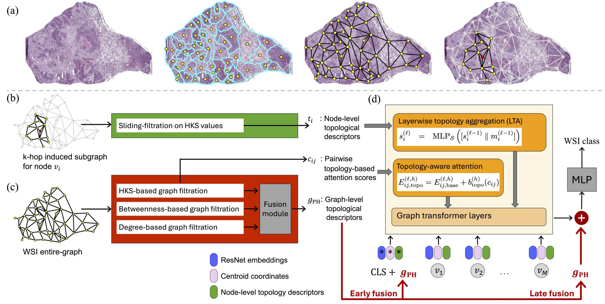

# Topology-Conditioned Graph Transformer

TC-GT for weakly supervised whole-slide classification. Tissue graphs are built as in the paper (SLIC regions, adjacency, ResNet node features). This repo starts from those graphs.



WSIs are from [TCGA](https://www.cancer.gov/ccg/research/genome-sequencing/tcga) (lung and kidney). Slide ids are listed in `data/slides.csv`.

```bash
python compute_ph.py --csv data/slides.csv --graph_dir /path/to/bins --out data/ph --cohort lung
python compute_local_topo.py --csv data/slides.csv --graph_dir /path/to/bins --out data/local_topo --cohort lung
python train.py --csv data/slides.csv --graph_dir /path/to/bins --task typing --cohort lung --fold 0 --use_ph --use_lta --use_bias
python main.py --mode train --task typing --cohort kidney --fold 0 --graph_dir /path/to/bins
```

`--task` is `typing` or `staging`. `--cohort` is `lung` or `kidney`.

```bibtex
@article{koc2026tcgt,
  title={Topology-Conditioned Graph Learning for Cancer Classification in Whole Slide Images},
  author={Koc, Soner and Caki, Onur and Gunduz-Demir, Cigdem},
  year={2026}
}
```
